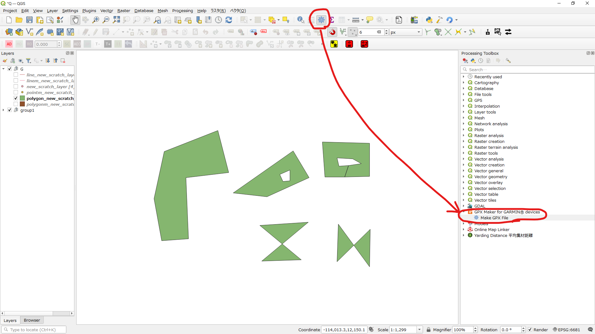
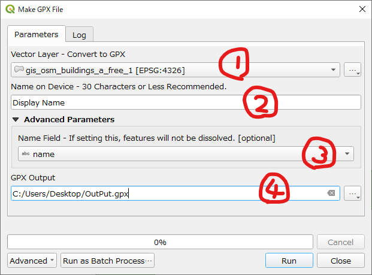
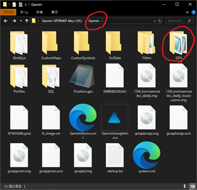
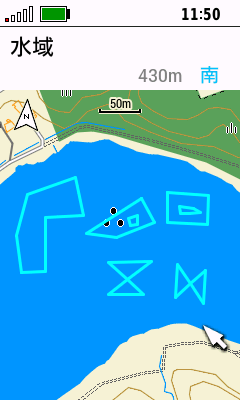

# GPX-Maker-for-Garmin-devices
This QGIS plugin outputs vector layers as GPX files, which you can import and view on your Garmin device. Supporting point layers, line layers, and polygon layers. By optional setting, you can output features without dissolving them. 

# How to Make GPX
## starting method
 
Launch GPX Maker from the Processing Tools panel. 
## Setting method
 
① Select the vector layer to output 
② Select the display name on the GARMIN device (corresponding to the name attribute) 
③ Additional option: Do not merge features, output them separately. Checking this box will ignore ② and set the attribute specified in ③ as the name attribute. 
④ Set the destination to save the GPX file. 

## Preservation method
 
Save it in the GPX folder inside your GARMIN device. 

# How to Display on your Garmin devices (ex.GPSMAP67i)
 
### Polygons and lines
Main Menu > Saved Tracks > Select Track > Menu > Show On Map 

### Points
No special settings required. Displayed on the screen by default. 
Main Menu > Waypoint Manager (You can delete them individually.)
